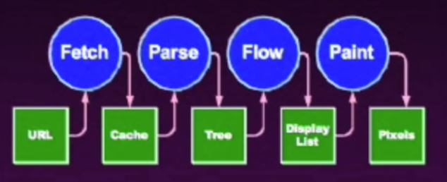
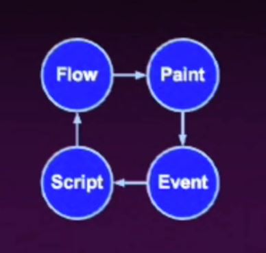
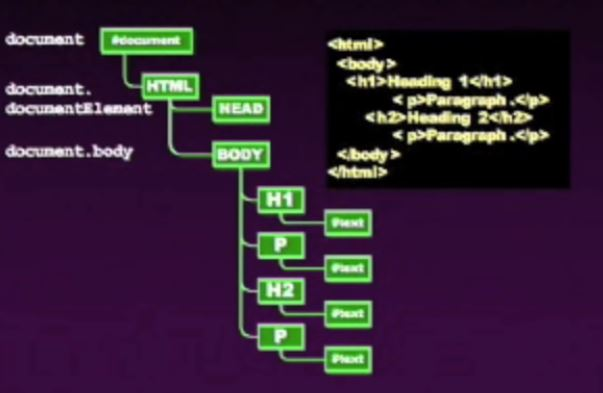

# Douglas Crockford - An Inconvenient API - The Theory of the DOM

## The Misconceived Web

- The original vision of the WWW was as a hyperlinked document retrieval system
- The initial design for hyper texts did not anticipate presentation, session or interactivity.
- If the  WWW  were still consistent with TBL's original vision, Yahoo would still be two guys in a trailer.

## How we got here

- Rule Breaking
- Corporate Warfare
- Extreme Time Pressure

## The Miracle

- It works!
- Java didn't
- Nor did a lot of other stuff. (things that have been supposed for interactive communication didn't)

## The Scripted Browser

- (1995) - Introduced in Netscape Navigator 2. First browser to have scripting built into it.
- Eclipsed by Java Applets
- Later became the frontline of the browser wars. (Microsoft & Navigator)
- Dynamic HTML
- Document Object Model (DOM)

## Proprietary Traps

- Netscape and LiveWire
- Microsoft and Internet Information Services
- Both server strategies frustrated by Apache
- Browser dependent sites

## Pax Microsoft

- In the years since the end of the Browser war, the number of browser variations in significant use fell of significcantly
- W3C attempts to unify.
- Mozilla abandoned the Netscape  layer  model in favor of the W3C model.
- After Netscape failed there was a huge reduction in the innovation of browser technology.
- The browser platform becomes somewhat stable.
- DHTML becomes known as Ajax.

## Browser working model



- innovation of netscape - when the  parse  hits image tag, it wouldn't know how big the image is, so it goes back to fetch engine get the image and resume. So until the full page is loaded the user had to wait.
- instead of waiting for fetch netscape put a placeholder and go ahead with the flow. ( repaint multiple times )
  - though longer rendering as a whole, from user perspective immediate content gets deliverd.

## Scripted Browser

- netscape took the idea further and introduced events



## script tag

- script tag was introduced by netscape for Navigator 2.0.
- HTML's rule - if you see a tag that's not recognized just display it's contents, which caused script tag to be displayed for older browsers (navigator 1.0 and Mosaic).
  - workaround for that. put html comment at the beginning of the script and then a js comment to close it at the other end.
  - navigator 2.0 parsed comments with js compiler.

```
<!-- // -->
```

- language=javascript (W3C - Deprecated)
  - introduced by microsoft to dominate javascript with  VB

- src=URL
  - netscape added in navigator 3.0
  - recommended
  - don't put code on pages

- type=text/javascript (replace language attribute by W3C)
  - it's ignored. no need to include

- script files can have a big impact on page loading time
  - place script tags as close to the bottom of the body as possible.
  - place CSS link tags as high in the head as possible
  - minify and gzip script files
  - reduce the number of script files as much as possible

## document.write (Don't Use)

- next innovation of netscape ( a bad idea in retrospect)
- allows js to produce html text
- before onload: iserts html text into document.
- after onload: uses html text to replace the current document

## Collections (Don't Use these)

- document.
  - anchors
  - applets
  - embeds
  - forms
  - frames
  - images
  - plugins
  - scripts
  - stylesheets

- these are obsolete now.

## name v id

- in terms of implementation they were interchangeable but not anymore

- name=
  - identifies values in form data
  - identifies a window/frame

- id=
  - uniquely identifies an element

## document.all ( Don't Use )

- response to netscape's implementation of specific collections Microsoft came up with this. rejected by W3C and most other browsers

- It acts as a function or array for accessing elements by  position, name or id

- Not portable to firefox

### Retrieving Nodes

- alternative to document.all & collections W3C proposed

```
document.getElementById(id)

document.getElementsByName(name)

node.getElementsByTagName(tagName)
//not just on full document but on any sub tree
```

## Document Tree



- document.getElementsByTagName gives Upper Case nodes

- The Tree shown above is IE tree. Firefox might give a different tree.
- Firefox's tree is denser.

```
document
//returns the full document. it's the root

document.documentElement
//returns the html tag sub tree

document.body
//returns the body
```

- child tree zoom in


- child tree with parent linkage


- these pointers are maintained by the browsers.
- consider these as read only as it's all taken care by browser.

- following are the only pointers necessary for manipulating a document.


- a classic binary tree.

## Walk the DOM

- Using recursion, follow the  firstChild  node and then the  nextSiblling  nodes.

```
function walkTheDom(node, func){
  func(node);
  //do something with the current node via func
  node = node.firstChild;
  while (node){
    walkTheDom(node, func);
    node = node.nextSibling;
  }
}
```
- getElementsByClassName  this is available now in browser it self which may be more efficient

```
function getElementsByClassName(className) {
  var results = [];
  walkTheDom(document.body, function(node){
    var a, c = node.className, i;
    if(c) {
      a = c.split(' ');
      for(i = 0; i < a.length; i += 1){
        if (a[i] === className) {
          results.push(node);
          break;
        }
      }
    }
  });
  return results;
}
```
-  className  instead of  class  ?  class  is reserved word in js

- className is still a wrong name as in reality it stores a bunch names instead of single name.

## childNodes


- an array of child nodes

## Manipulating Elements

- IMG has these properties

| attribute     | type/values               |
|---------------|---------------------------|
| align         | 'none', 'top', 'left',... |
| alt           | string ( shows on hover)  |
| border        | integer (pixels)          |
| height        | integer (pixels)          |
| hspace        | integer (pixels)          |
| id            | string                    |
| isMap         | boolean                   |
| src           | url                       |
| useMap        | url                       |
| vspace        | integer (pixels)          |
| width         | integer (pixels)          |

-  node.property  = expression;
- old school

```
if (my_image.complete) {
  my_image.src = superurl;
}
// seems simple and easier
```

- New school

```
if (my_image.getAttribute('complete')) {
  my_image.setAttribute('src', superurl);
}
```
## Style

```
node.className
// classNames seperated by spaces

node.style.<stylename>
// more specific manipulating

node.currentStyle.<stylename>
//current state. convienent to use but only in IE

document.defaultView().
  getComputedStyle(node, "").
  getPropertyValue(<stylename>);
//W3C's alternative to currentStyle. developed by JavaDevelopers not by js devs

```

## Style Names

- both developed about same time but naming is not compatibl
- js convention by netscape. could've have designed better.

|     css                 |       javascript      |
|-------------------------|-----------------------|
| background-color        | backgroundColor       |
| border-radius           | borderRadius          |
| font-size               | fontSize              |
| list-style-type         | listStyleType         |
| word-spacing            | wordSpacing           |
| z-index                 | zIndex                |

## Making Elements

```
document.createElement("tagName");
//creates an element => <tagName></tagName>

document.createTextNode("text")
//creates a simple text

node.cloneNode()
//clone an individual element

node.cloneNode(true)
//clone an element and all of its descendents
```

- the new nodes are not yet connected to the document

## Linking Elements

```
//<node> <old> is the tag/document tree object
//new thing that was created before

<node>.appendChild(<new>);

<node>.insertBefore(<new>, <sibling>);

<node>.replaceChild(<new>,<old>);

<old>.parentNode.replaceChild(<new>, <old>);
```

## Removing Elements
```
<node>.removeChild(old)
// it returns the node event handlers
// be sure to remove any events linked to the object before removing

<old>.parentNode.removeChild(<old>);
```

## innerHTML

- W3C standard does not provide access to the HTML parser.
- All A browsers implement Microsoft's  innerHTML  property.

## Which way is better?

- It is better to build or clone elements and append them to the document.
- Or is it better to compile an HTML text and use innerHTML to realize it.
- Favor clean code and easy maintenance.
- Favor performance only in extreme cases.

 ## The Event Model

 - The browser has an event driven, single-threaded, asynchronous programming model.
 - Events are targetted to particular nodes.
 - Events cause the invocation of event handler functions.
 - many different types of events are present.

 ## Events

 - Classic

 ```
 <node>["on" + <type>] = <someFunction>;
 // only this works everywhere
 ```

 - Microsoftx

 ```
 <node>.attachEvent("on" + <type>, <someFunction>);
 ```

 - W3C

 ```
 <node>.addEventListener(<type>, <someFunction>, false);
 ```

## Event handlers

- The handler takes an optional event parameter.
  - Microsoft doesn't send an event parameter, use the global  event  object instead.

```
function (e) {
  e = e || event;
  var target = e.target || e.srcElement;
  ...
}
```

## Event Dispatching ( Trickling and Bubbling )

- Trickling is an event capturing pattern which provides compatibility with the Netscape 4 model. Avoid it.

- Bubbling means that the event is given to the target and then its parent, and then its parent. and so on until the event is cancelled.

## Why Bubble?

- Suppose you have 100 draggable objects.
- You could attach 100 sets of event handlers to those objects.
- Or you could attach one set of event handler to the container of the 100 objects.

## Cancel Bubbling

- Cancel bubblingto keep the parent nodes from seeing the event.

```
e.cancelBubble = true;
if (e.stopPropagation) {
  e.stopPropagation();
}
```

## Prevent Default Action

- An event handler can prevent a browser action associated with the event (such as submitting a form).

```
e.returnValue =false;
//IE technique
if(e.preventDefault) {
  e.preventDefault();
}
//W3C technique
return false;
```

## Memory Leaks

- Memory management is automatic.
- It is possible to hang on to too much state, preventing it from being garbage collected.

## Memory Leaks on IE 6

- explicitly remove all of your event handlers from nodes before you discard them.
- IE6 DOM uses a reference counting garbage collector.
  - increasing counter for the object references whenever a reference is pointed to that object and remove it when it reaches zero.
  - this becomes a problem when a dom object is referenced in js in a closure which makes it stay in the system forever.
- Reference counting is not able to reclaim cyclical structures.
- You must break the cycles yourself.
- That was not an issue for page view driven applications.
- it's a showstopper for Ajax applications.
- It's fixed in the next version
- But it's an independent software download to update which never happens.
- So, remove all event handlers from delete DOM nodes.
- It must be done on nodes before removeChild or replaceChild.
- it must be done on nodes before they are replaced by changing innerHTML

## Breaking links in the DOM

```
function purgeEventHandlers(node) {
  walkTheDOM(node, function (e) {
    for (var n in e) {
      if(typeof e[n] === 'function') {
        e[n] = null;
      }
    }
  })
}
```

## JavaScript functions

- alert(text)
- confirm(text)
- prompt(text, default)
  - these functions break the asynchronous model.
  - avoid these in ajax applications
- setTimeout(func, msec)
- setInterval(func, msec )

## window

- The  window  object is also the javascript global object.
- Every window, fram, and iframe has its own unique  window  object.
- aka  self  and sometimes  parent  and  top .

## inter window (apis and security)

| object    | meaning                 |
|-----------|-------------------------|
| frames[]  | child frames and iframes|
| name      | text name of window     |
| opener    | reference to open       |
| parent    | ref to parent           |
| self      | ref to this window      |
| top       | ref to outermost        |
| window    | ref to this window      |
| open()    | open new window         |

- a script can access another window if it can get a reference to it.

```
  document.domain === otherwindow.document.domain
```

- same origin policy

## Cross Browser

- weak standards result in significant vendor-specific differences between browsers.
- principle ways to solve this
  - browser detection.
  - feature detection.
  - platform libraries.

### browser detection ( don't use )

- determine what kind of browser that page is running in.
- execute conditionally.
- the browsers lie.

```
navigator.userAgent Mozilla/4.0
```

- brittle not recommended

### Feature Detection

- using reflection, ask if desired features are present.

- execute conditionally

```
function addEventHandler(node, type, f) {
  if (node.addEventListener) {
    node.addEventListener(type, f, false);
  }
  else if (node.attachEvent) {
    node.attachEvent("on" + type, f);
  }
  else {
    node["on" + type] = f;
  }
}
```

- use some thirparty Library.

## Cracks of DOM

- The DOM buglist includes all of the bugs in the browser.
- The DOM buglist includes all of the bugs in all supported browsers.
- No DOM completely implements the standards.
- Much of the DOM is not described in any standard.

## Coping

- Do what works.
- Do what is common.
- Do what is standard.

## The Wall

- Browsers are now being push to their limits
- Be prepared to back off.
- Reduce your memory requirements.
- Balance of client and server.

## The Hole.

- The browser was not designed to be a general purpose application platform.
- Lacks a compositing model.
- Accessibility suffers.
- Lacks support for cooperation under mutual suspicion.

## WWW War II

- Microsoft has awoken. They are beginning to innovate again.
- There are now 4 major browsers.
- They will be flooding the web with bugs.

# <center> --- End -- </center>
