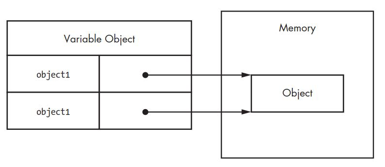

# The principles of Object - Oriented Javascript by Nicholas C. Zakas

## Object Oriented Concepts

<dl>

<dt> Encapsulation </dt>
<dd>
Data can be grouped together with functionality
that operates on that data. This, quite simply, is the definition of an object.
</dd>
<br>
<dt> Aggregation  </dt>
<dd> One object can reference another object. </dd>
<br>
<dt>  Inheritance  <dt>
<dd> A newly created object has the same characteristics
as another object without explicitly duplicating its functionality.
</dd>
<br>
<dt>  Polymorphism  </dt>
<dd> One interface may be implemented by multiple objects. </dd>

</dl>

## Chapter 1 : PRIMITIVE AND REFERENCE TYPES

### Types in JS

- Primitive Type : stored as simple data Types
- Reference Type : stored as object, which are really just references to locations in memory.

Other languages store Primitive types in  stack  and Reference Types in  heaps . JS doesn't work like that.

JS tracks variables for particular scope in  variable object .

Primitive values are placed directly on  variable objects .
Reference values are stored as pointer to  variable objects  which serves as a reference to location where the object is stored in memory.

### Primitive Types

| Type        | desc                                           |
|-------------|------------------------------------------------|
| Boolean     | true or false                                  |
| Number      | Any integer or floating-point numeric value    |
| String      | A character or sequence of characters.         |
| Null        |  null  - means nothingness                 |
| Undefined   |  undefined  - means not initialized        |

-  Literals  represent values that aren’t stored in a
variable, such as a hardcoded name or price.

- Primitive Values - stored directly in variable.
- Copying - implies each variable has its copy of data.

```
var color1 = "red";
var color2 = color1;
```
- here value in  color1  is copied to  color2  .
- so  color2  has its own copy of that value.
- the memory space for  color1  and  color2  are independent.
- changing value of  color1  doesn't affect value of  color2 .

```
color1 = "blue";
// color2 retains its value red.
```
#### identifying primitive Types

-  typeof  operator - returns a string value of type.
-  typeof  doesn't do coercion.

|  typeof     |  return value      |
|-----------------|--------------------|
| 10              | "number"           |
| "name"          | "string"           |
| true            | "boolean"          |
| "10"            | "string"           |
| undefined       | "undefined"        |
| null            | "object" (an error in ) language itself|

- only way to identify  null

```
someVar === null
```
#### == Vs ===

-  ==  applies coercion and compares, because of which the following are true

```
"5" == 5
null == undefined
```

-  ===  compares both type and value. always use this.

#### Primitive methods

-  string ,  boolean  and  number  types have methods even though they are primitve types.
-  undefined  and  null  doesn't have any methods.

> Despite the fact that they have methods, primitive values themselves are not objects.
JavaScript makes them look like objects to provide a consistent experience in the
language

### Reference types

- Reference types represent objects in JavaScript
- Reference values are instances of reference types or called simply as  objects
- Everything other than primitive values are reference values in JS.
- An object is an unordered list of properties consisting of a name (always a string) and a value

#### Creating Objects

##### Method 1 - Via constructors

- Any function can be used as constructor with  new .
- But constructors should always start with capital but this is just a convention.

```
var myObject1 = new Object();
```
- reference types only store pointers (i.e)
- the object is created in memory and the reference pointer to the location of the created object is assigned to  myObject1
- Copying the  myObject1  to any variable, copies only the reference pointer and not the value.

```
var myObject2 = myObject1;
// so changing properties of myObject1 will be reflected everywhere the object is referenced
```
- reference types - storage



##### Dereferencing Objects

- JS is garbarage collected language.
- to derreference simply assign all variables referencing to that object to null.

##### Built-in types

- all Built-in types can instantiated by using  new  <built-in-type>()

| Object Type   |  desc                                        |
|---------------|----------------------------------------------|
| Array         | An ordered list of numerically indexed values|
| Date          | Date A date and time                         |
| Error         | A runtime error(other specific types exists) |
| Function      | A function                                   |
| Object        | A generic object                             |
| RegExp        | A regular expression                         |

- examples

```
var items = new Array();
var now = new Date();
var error = new Error("Something bad happened.");
var func = new Function("console.log('Hi');");
var object = new Object();
var re = new RegExp("\\d+");
```
#### Literals

- A  literal  is syntax that allows you to define a reference value without explicitly creating an object, using the new operator and the object’s constructor.
- no difference of end result


> Using an object literal doesn’t actually call new Object(). Instead, the JavaScript
engine follows the same steps it does when using new Object() without actually
calling the constructor. This is true for all reference literals.

 Pure Object Literal

```
// object literal
var book = {
    "name": "The Principles of Object-Oriented JavaScript",
    year: 2014
};
// via Object constructor
var book = new Object();
book.name = "The Principles of Object-Oriented JavaScript";
book.year = 2014;
```

 Array Literal

```
// Array literal
var colors = [ "red", "blue", "green" ];
console.log(colors[0]);     // "red"

// via array Object
var colors = new Array("red", "blue", "green")
console.log(colors[0]);     // "red"
```


 Function Literal

```
//funciton literal
function reflect(value) {
    return value;
}
// via function object - Not recommended
var reflect = new Function("value", "return value;");
```

 RegExp

```
var numbers = /\d+/g;
// is the same as
var numbers = new RegExp("\\d+", "g");
```

#### Accessing properties

- dot notation - more readable
- [] notation - used for dynamic access and properties with space & special characters

```
var array = [];
array.push(12345);

// same as

var array = [];
array["push"](12345);

// can be used like
var array = [];
var method = "push";
array[method](12345);
```

#### identifying reference types

 functions

- easiest to identify

```
function putVal(val) {
    return val;
}
console.log(typeof putVal);    // "function"
```

 Other reference types

- Other types are tricky, as everything returns  "object"
- use  instanceof
  - When the value is an instance of the type that the constructor specifies,  instanceof  returns true; otherwise, it returns false
  - identifies inherited types as well


```
var items = [];
var object = {};
function reflect(value) {
    return value;
}
console.log(items instanceof Array);        // true
console.log(object instanceof Object);      // true
console.log(reflect instanceof Function);   // true
```

- Every object by default inherits from  Object , so

```
var items = [];
var object = {};
function reflect(value) {
    return value;
}
console.log(items instanceof Array);        // true
console.log(items instanceof Object);       // true
console.log(object instanceof Object);      // true
console.log(object instanceof Array);       // false
console.log(reflect instanceof Function);   // true
console.log(reflect instanceof Object);     // true
```

 Identifying Array

- js values can be passed around between frames.
- identifying reference types becomes a problem when this happens.
- each frame has its own global context which has Object, Array and all other built in types.
- so instanceof doesn't work when array is passed from one frame to another as it's an instance of  Array  from another context.
- to solve this  ECMA5  introduced  Array.isArray() which works on all cases.

```
var items = [];
console.log(Array.isArray(items));      // true
```

### Primitive Wrapper types

- String, Number and boolean
- Enables primitive types to be used like reference types which gives access to methods.
- automatically created behind the scenes whenever strings, numbers, or Booleans are read.

```
var name = "Nicholas";
// treats name like an object
var firstChar = name.charAt(0);
console.log(firstChar);                 // "N"
```

- Behind the scenes

```
// what the JavaScript engine does
var name = "Nicholas";
var temp = new String(name);
var firstChar = temp.charAt(0);
temp = null;
console.log(firstChar);                 // "N"
```

- this temporary creation of String object behind the scenes is called  autoboxing .
- the  temp  string object immediately gets destroyed as soon as method on string is executed.

```
var name = "Nicholas";
name.last = "Zakas";
// value disappears as name is just a primitive type and property got added to autoboxed object which gets destroyed immediately.
console.log(name.last);                 // undefined
```

- behind the scenes

```
// what the JavaScript engine does
var name = "Nicholas";
var temp = new String(name);
temp.last = "Zakas";
temp = null;                            // temporary object destroyed

var temp = new String(name);
console.log(temp.last);                 // undefined
temp = null;
```

- Although reference values are created automatically for primitive values, when  instanceof  checks for these types of values the result is false

```
var name = "Nicholas";
var count = 10;
var found = false;

console.log(name instanceof String);    // false
console.log(count instanceof Number);   // false
console.log(found instanceof Boolean);  // false
```

- It is not advised to use primitive wrappers directly.
-  typeof  can't identify types if used directly.

```
var name = new String("Nicholas");
var count = new Number(10);
var found = new Boolean(false);

console.log(typeof name);           // "object"
console.log(typeof count);          // "object"
console.log(typeof found);          // "object"
```

- even though it means false - since it's wrapped around primitive objects it will coerce to true in if loops

```
var found = new Boolean(false);
if (found) {
    console.log("Found");       // this executes
}
```
